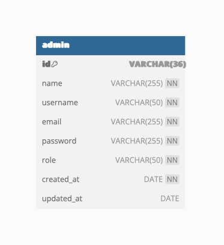

# 5.2.1 Bảng admin

Bảng admin chứa thông tin về người quản trị hệ thống, là người có quyền truy cập cao nhất và thực hiện các nhiệm vụ quản lý mà người dùng thông thường không thể thực hiện. Các chức năng cụ thể bao gồm:&#x20;

* **Quản lý người dùng**: Admin có khả năng xem thông tin chi tiết về tất cả người dùng, thêm người dùng mới, chỉnh sửa thông tin người dùng hiện tại, vô hiệu hóa hoặc xóa tài khoản người dùng. Điều này cho phép admin kiểm soát ai có quyền truy cập và sử dụng hệ thống.
* **Quản lý nội dung**: Admin có thể tạo, chỉnh sửa, và xóa các flashcards, folders, classes, hoặc bất kỳ nội dung nào khác trong hệ thống. Điều này giúp đảm bảo rằng nội dung được cung cấp cho người dùng là chính xác, cập nhật và phù hợp.
* **Xem và phân tích dữ liệu**: Admin có thể xem dữ liệu và báo cáo phân tích từ hệ thống. Điều này bao gồm, nhưng không giới hạn ở, dữ liệu về cách người dùng sử dụng ứng dụng, số lượng người dùng mới, số lượng flashcards được tạo, và nhiều loại dữ liệu khác. Điều này giúp admin hiểu rõ hơn về cách hệ thống đang được sử dụng, và từ đó, có thể đưa ra quyết định để cải thiện hệ thống.

<figure><figcaption><p>Bảng admin</p></figcaption></figure>

Giải thích chi tiết các trường trong bảng

<table><thead><tr><th width="77" data-type="number">No.</th><th width="136">Name</th><th width="131">Type</th><th data-type="number">Length</th><th data-type="checkbox">NOT NULL</th><th width="63">Key</th><th width="207">Ghi chú</th></tr></thead><tbody><tr><td>1</td><td>id</td><td>VARCHAR</td><td>36</td><td>true</td><td>PK</td><td>Đây là khóa chính duy nhất đại diện cho mỗi người quản trị.</td></tr><tr><td>2</td><td>name</td><td>VARCHAR</td><td>255</td><td>true</td><td></td><td>Tên của người quản trị.</td></tr><tr><td>3</td><td>username</td><td>VARCHAR</td><td>50</td><td>true</td><td></td><td>Tên người dùng duy nhất mà người quản trị sử dụng để đăng nhập vào hệ thống.</td></tr><tr><td>4</td><td>email</td><td>VARCHAR</td><td>255</td><td>true</td><td></td><td>Địa chỉ email duy nhất của người quản trị. Địa chỉ email này có thể được sử dụng cho việc phục hồi mật khẩu hoặc gửi thông báo quan trọng từ hệ thống.</td></tr><tr><td>5</td><td>password</td><td>VARCHAR</td><td>255</td><td>true</td><td></td><td>Mật khẩu mà người quản trị sử dụng để đăng nhập vào hệ thống. Lưu ý rằng mật khẩu này nên được mã hóa và không nên lưu trực tiếp trong cơ sở dữ liệu.</td></tr><tr><td>6</td><td>role</td><td>VARCHAR</td><td>50</td><td>true</td><td></td><td>Vai trò của người quản trị trong hệ thống. Điều này có thể đề cập đến cấp độ quyền truy cập hoặc vai trò cụ thể mà người quản trị này đảm nhận (ví dụ: 'superadmin', 'content manager', v.v.).</td></tr><tr><td>7</td><td>created_at</td><td>DATE</td><td>null</td><td>true</td><td></td><td>Ngày mà admin được tạo</td></tr><tr><td>8</td><td>updated_at</td><td>DATE</td><td>null</td><td>false</td><td></td><td>Ngày mà admin được cập nhật thông tin trong tài khoản</td></tr></tbody></table>


**Câu lệnh SQLite:**

```sql
CREATE TABLE admin(
  id TEXT PRIMARY KEY,
  name TEXT NOT NULL,
  username TEXT UNIQUE NOT NULL,
  email TEXT UNIQUE NOT NULL,
  password TEXT NOT NULL,
  role TEXT NOT NULL,
  created_at DATE NOT NULL,
  updated_at DATE
);
```

**Dữ liệu mẫu:**&#x20;

**Bản ghi 1:**

* `id`: "550e8400-e29b-41d4-a716-446655440000"
* `name`: "Nguyen Van A"
* `username`: "nv\_a"
* `email`: "[nva@example.com](mailto:nva@example.com)"
* `password`: "hashed\_password\_1"
* `role`: "superadmin"
* `created_at`: "2023-11-10"
* `updated_at`: NULL

**Bản ghi 2:**

* `id`: "550e8400-e29b-41d4-a716-446655440001"
* `name`: "Tran Thi B"
* `username`: "tt\_b"
* `email`: "[ttb@example.com](mailto:ttb@example.com)"
* `password`: "hashed\_password\_2"
* `role`: "content\_manager"
* `created_at`: "2023-10-30"
* `updated_at`: "2023-11-01"

