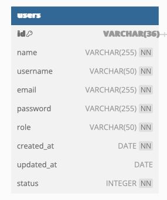

# 5.2.2 Bảng user

Mỗi bảng user chứa các thông tin của người dùng, là người tương tác với hệ thống. Người dùng có thể là học sinh, giáo viên, hoặc bất kỳ ai muốn học và chia sẻ kiến thức thông qua flashcards. Các chức năng cụ thể của một `user` bao gồm:

* **Tạo và sử dụng nội dung**: Người dùng có thể tạo flashcards, folders, và classes cho mục đích học tập của họ. Họ cũng có thể sử dụng flashcards do người khác tạo ra để học và ôn tập kiến thức.
* **Tương tác với người dùng khác**: Người dùng có thể chia sẻ flashcards, folders, hoặc classes với người dùng khác, hoặc thậm chí tham gia vào các nhóm học tập do người khác tạo ra.
* **Theo dõi tiến trình**: Người dùng có thể sử dụng các tính năng của hệ thống để theo dõi tiến trình học tập của họ, như xem lại lịch sử học tập, kiểm tra điểm số của các bài kiểm tra, v.v...
* **Cài đặt cá nhân**: Người dùng có thể điều chỉnh cài đặt cá nhân của họ trên hệ thống, bao gồm thông tin cá nhân, cài đặt bảo mật, và tùy chỉnh giao diện người dùng.

<figure><figcaption><p>Bảng user</p></figcaption></figure>

<figure><figcaption><p> Mối quan hệ của bảng user với các bảng khác </p></figcaption></figure>

Giải thích chi tiết các trường trong bảng:

<table><thead><tr><th width="77" data-type="number">No.</th><th width="136">Name</th><th width="131">Type</th><th data-type="number">Length</th><th data-type="checkbox">NOT NULL</th><th width="63">Key</th><th width="418">Ghi chú</th><th></th></tr></thead><tbody><tr><td>1</td><td>id</td><td>VARCHAR</td><td>36</td><td>true</td><td>PK</td><td>Đây là khóa chính (primary key) của bảng. Mỗi người dùng sẽ có một <code>id</code> duy nhất để phân biệt với người dùng khác. Trường <code>id</code> này sử dụng UUID (Universally Unique Identifier), là một chuỗi 128-bit đại diện cho một ID duy nhất trên toàn cầu, thường được biểu diễn dưới dạng chuỗi 36 ký tự (bao gồm các dấu gạch ngang).</td><td></td></tr><tr><td>2</td><td>name</td><td>VARCHAR</td><td>255</td><td>true</td><td></td><td>Đây là trường để lưu trữ tên của người dùng. Trường này không thể NULL, tức là bạn phải cung cấp tên cho mỗi người dùng.</td><td></td></tr><tr><td>3</td><td>username</td><td>VARCHAR</td><td>50</td><td>true</td><td></td><td>Tên người dùng duy nhất được sử dụng để đăng nhập. Trường <code>username</code> này không thể NULL và phải là duy nhất.</td><td></td></tr><tr><td>4</td><td>email</td><td>VARCHAR</td><td>255</td><td>true</td><td></td><td>Đây là trường để lưu trữ email của người dùng</td><td></td></tr><tr><td>5</td><td>password</td><td>VARCHAR</td><td>255</td><td>true</td><td></td><td>Trường này để lưu trữ mật khẩu của người dùng</td><td></td></tr><tr><td>6</td><td>role</td><td>INTEGER</td><td>1</td><td>true</td><td></td><td>Vai trò của người : 0 - Không là gì hết; 1 - Học sinh; 2 - Giáo viên</td><td></td></tr><tr><td>7</td><td>created_at</td><td>DATE</td><td>null</td><td>true</td><td></td><td>Ngày mà người dùng được tạo trong hệ thống. Trường này không thể NULL.</td><td></td></tr><tr><td>8</td><td>updated_at</td><td>DATE</td><td>null</td><td>false</td><td></td><td>Ngày mà thông tin người dùng được cập nhật lần cuối. Trường này có thể NULL nếu thông tin người dùng chưa bao giờ được cập nhật.</td><td></td></tr><tr><td>9</td><td>status</td><td>INTEGER</td><td>null</td><td>true</td><td></td><td>Trường này để xác định trạng thái của người dùng. Đây là một số nguyên và không thể NULL. Các giá trị cụ thể cho trạng thái phụ thuộc vào định nghĩa cụ thể của bạn (ví dụ: 0 có thể đại diện cho "inactive", 1 có thể đại diện cho "active", v.v...).</td><td></td></tr></tbody></table>


Câu lệnh tạo bảng SQLIte:&#x20;

```sql
CREATE TABLE users (
  id TEXT PRIMARY KEY,
  name TEXT NOT NULL,
  username TEXT NOT NULL UNIQUE,
  email TEXT NOT NULL,
  password TEXT NOT NULL,
  role TEXT NOT NULL,
  created_at TEXT NOT NULL,
  updated_at TEXT,
  status INTEGER NOT NULL
);
```

Dữ liệu mẫu:&#x20;

**Bản ghi 1:**

* `id`: "550e8400-e29b-41d4-a716-446655440000"
* `name`: "Nguyen Van A"
* `username`: "nv\_a"
* `email`: "[nva@example.com](mailto:nva@example.com)"
* `password`: "hashed\_password\_1"
* `role`: "1"
* `created_at`: "2023-11-10"
* `updated_at`: NULL
* `status: 1`

**Bản ghi 2:**

* `id`: "550e8400-e29b-41d4-a716-446655440000"
* `name`: "Nguyen Van B"
* `username`: "nv\_b"
* `email`: "[nva@example.com](mailto:nva@example.com)"
* `password`: "hashed\_password\_2"
* `role`: "1"
* `created_at`: "2023-11-10"
* `updated_at`: "2023-11-10"
* `status: 0`

