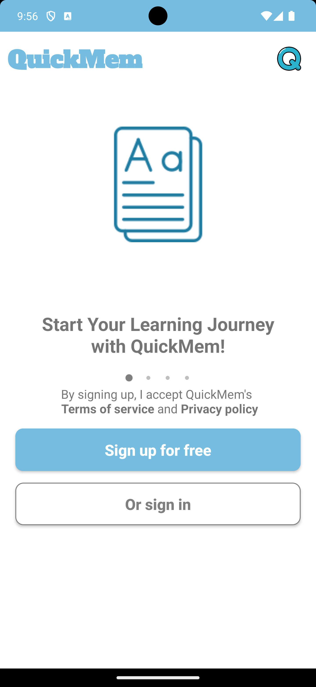
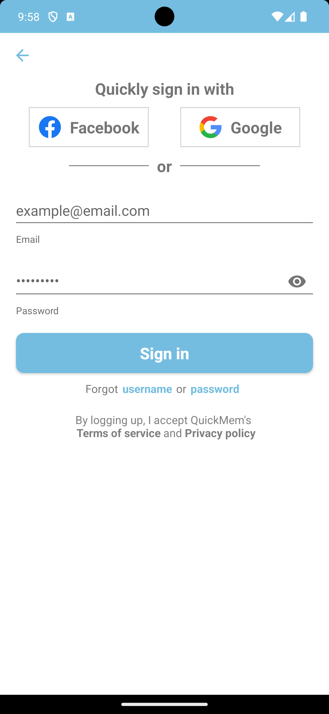

## Quick

It's an app learning by flashcard using Kotlin, Java, and SQLite.
I use a lot of libraries to make it easy to use and make it more beautiful.
I hope you like it.

## Support Platform

- Android 7.0 (API 24) or higher

## Features

- [x] Create a new deck which can contain many cards
- [x] Create a new card in a deck
- [x] Edit a deck
- [x] Edit a card
- [x] Delete a deck
- [x] Delete a card
- [x] Learn by flashcard
- [x] Learn by quiz
- [] Learn by true/false
- [] Learn by filling in the blank
- [] Learn by matching
- [] Notification
- [] Firebase
- [x] Learn by multiple choice
- [x] Add to folder
- [x] Add to class
- [x] Decode password
- [x] Encode password
- [x] And more...

## Technologies Used

- [x] Kotlin
- [x] Java
- [x] SQLite
- [x] AndroidX
- [x] Material Design
- [x] Navigation Component
- [x] Library
- [x] And more...

## Screenshots

<table>
  <tr>
    <td></td>
    <td></td>
    <td></td>
</tr>
<tr>
<td>Welcome</td>
<td>Sign In</td>
<td>Sign Up</td>
</tr>

</table>
<p>Will add soon</p>

## Video
Coming soon

## Contributing
You can contribute this project. Just Solve issue or update code and raise PR. I'll do code review and merge your changes into main branch. See Commit message guidelines https://initialcommit.com/blog/git-commit-messages-best-practices

## Installation
Clone this repository and import into **Android Studio**
```bash
git clone https://github.com/daominh-studio/quickmem.git
```

## Maintainers
This project is mantained by:
* [nqmgaming](https://github.com/nqmgaming)
* [Daocon](https://github.com/Daocon)

## License
This project is licensed under the MIT License - see the [LICENSE.md](LICENSE.md) file for details

## Acknowledgments
* [Android Studio](https://developer.android.com/studio)
* [Kotlin](https://kotlinlang.org/)
* [Java](https://www.java.com/en/)
* [SQLite](https://www.sqlite.org/index.html)
* [AndroidX](https://developer.android.com/jetpack/androidx)
* [Material Design](https://material.io/)
* [Navigation Component](https://developer.android.com/guide/navigation)
* [Library](https://developer.android.com/studio/projects/android-library)
* [And more...](https://developer.android.com/docs)

## Authors
Nguyen Quang Minh